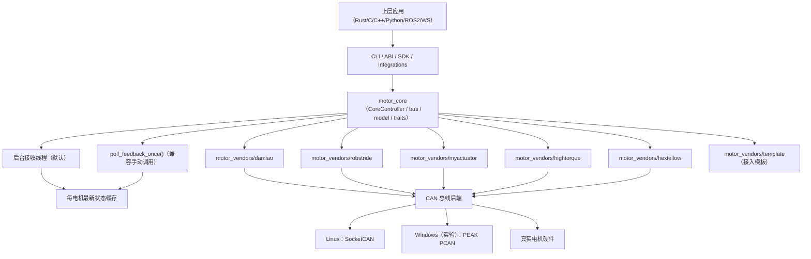
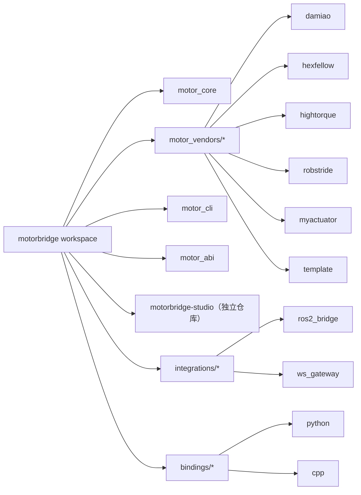
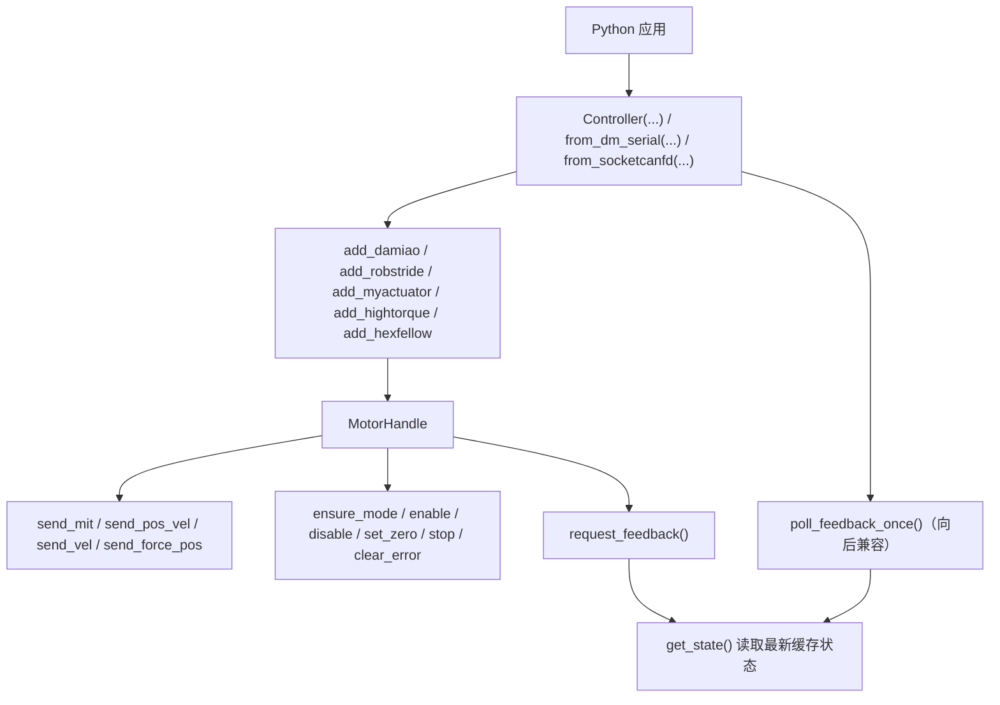

# motorbridge

[](https://www.rust-lang.org/)
[](https://www.python.org/)
[](LICENSE)
[](README.zh-CN.md#发布与安装总览完整矩阵)
[](https://github.com/tianrking/motorbridge/releases)

这是一个统一的 CAN 电机控制栈，包含 vendor-agnostic Rust core、稳定 C ABI，以及 Python/C++ bindings。

> English version: [README.md](README.md)

## 配套仓库

- `motorbridge-studio`：https://github.com/tianrking/motorbridge-studio
  基于 `ws_gateway` 的独立 Web 控制台。

## 传输链路标识

- `[STD-CAN]`：标准 CAN 路径（`socketcan` / `pcan`）
- `[CAN-FD]`：独立 CAN-FD 路径（`socketcanfd`）
- `[DM-SERIAL]`：Damiao 串口桥路径（`dm-serial`）

当前状态：
- `[CAN-FD]` 已完成独立链路接入。
- 仓库内尚未声明“某个电机型号已完成 CAN-FD 量产级验证矩阵”。

## 当前支持的厂商

- Damiao:
  - 型号: `3507`, `4310`, `4310P`, `4340`, `4340P`, `6006`, `8006`, `8009`, `10010L`, `10010`, `H3510`, `G6215`, `H6220`, `JH11`, `6248P`
  - 模式: `scan`, `MIT`, `POS_VEL`, `VEL`, `FORCE_POS`
- RobStride:
  - 型号: `rs-00`, `rs-01`, `rs-02`, `rs-03`, `rs-04`, `rs-05`, `rs-06`
  - 模式: `scan`, `ping`, `MIT`, `POS_VEL`, `VEL`, 参数读写
  - 说明: 力矩/电流当前仅支持参数级写入（如 `iq_ref`/限幅参数），尚未开放为统一高层模式
- MyActuator:
  - 型号: `X8`（运行时字符串，协议按 ID 通信）
  - 模式: `scan`, `enable`, `disable`, `stop`, `set-zero`, `status`, `current`, `vel`, `pos`, `version`, `mode-query`
- HighTorque:
  - 型号: `hightorque`（运行时字符串，原生 `ht_can v1.5.5`）
  - 模式: `scan`, `read`, `mit`, `pos-vel`, `vel`, `stop`, `brake`, `rezero`
- Hexfellow:
  - 型号: `hexfellow`（运行时字符串，CANopen 配置）
  - 模式: `scan`, `status`, `enable`, `disable`, `pos-vel`, `mit`（通过 `socketcanfd`）

## 更新说明（2026-04）：Damiao / RobStride 能力收敛

- Damiao：`scan / enable / disable / MIT / POS_VEL / VEL / FORCE_POS / set-id / set-zero` 均已纳入生产基线。
- RobStride：`scan / ping / enable / disable / MIT / POS_VEL / VEL / 参数读写 / set-id / zero` 已可用。
- RobStride 默认 host/feedback 路径为 `0xFD`；扫描默认尝试 `0xFD,0xFF,0xFE,0x00,0xAA`。
- RobStride 的 `feedback_id` / `host_id` 是上位机侧 ID，不是电机 `device_id`；扫描命中的电机 ID 看 `probe` / `device_id`。
- RobStride `pos-vel` 的 `--vel/--kd/--tau` 属于无效参数：CLI 仅 warning，不会中断。

## 架构

### 分层运行时视图



### 工作区拓扑（最新版）



### Python Binding 接口视图（v0.1.7+）



- [`motor_core`](motor_core): 与厂商无关的控制器、路由、CAN 总线层（Linux SocketCAN / Windows 实验性 PCAN）
- [`motor_vendors/damiao`](motor_vendors/damiao): Damiao 协议 / 型号 / 寄存器
- [`motor_vendors/hexfellow`](motor_vendors/hexfellow): Hexfellow CANopen-over-CAN-FD 实现
- [`motor_vendors/hightorque`](motor_vendors/hightorque): HighTorque 原生 ht_can 协议实现
- [`motor_vendors/robstride`](motor_vendors/robstride): RobStride 扩展 CAN 协议 / 型号 / 参数
- [`motor_vendors/myactuator`](motor_vendors/myactuator): MyActuator CAN 协议实现
- [`motor_cli`](motor_cli): 统一 Rust CLI
  - 全参数英文文档: [`motor_cli/README.md`](motor_cli/README.md)
  - 全参数中文文档: [`motor_cli/README.zh-CN.md`](motor_cli/README.zh-CN.md)
  - Damiao 指令/寄存器文档: [`motor_cli/DAMIAO_API.md`](motor_cli/DAMIAO_API.md), [`motor_cli/DAMIAO_API.zh-CN.md`](motor_cli/DAMIAO_API.zh-CN.md)
  - RobStride 指令/参数文档: [`motor_cli/ROBSTRIDE_API.md`](motor_cli/ROBSTRIDE_API.md), [`motor_cli/ROBSTRIDE_API.zh-CN.md`](motor_cli/ROBSTRIDE_API.zh-CN.md)
  - MyActuator 指令/模式文档: [`motor_cli/MYACTUATOR_API.md`](motor_cli/MYACTUATOR_API.md), [`motor_cli/MYACTUATOR_API.zh-CN.md`](motor_cli/MYACTUATOR_API.zh-CN.md)
- [`motor_abi`](motor_abi): 稳定 C ABI
- [`bindings/python`](bindings/python): Python SDK + `motorbridge-cli`
- [`bindings/cpp`](bindings/cpp): C++ RAII wrapper
- `motorbridge-studio`：独立的 Web 控制台仓库（由 `tools/factory_calib_ui_ws` 拆分而来）

## 快速开始

构建:

```bash
cargo build
```

拉起 CAN:

```bash
sudo ip link set can0 down 2>/dev/null || true
sudo ip link set can0 type can bitrate 1000000 restart-ms 100
sudo ip link set can0 up
ip -details link show can0
```

Linux 下快速重启 CAN：

```bash
# 默认：can0 / 1Mbps / restart-ms=100 / loopback 关闭
IF=can0; BITRATE=1000000; RESTART_MS=100; LOOPBACK=off
sudo ip link set "$IF" down 2>/dev/null || true
if [ "$LOOPBACK" = "on" ]; then
  sudo ip link set "$IF" type can bitrate "$BITRATE" restart-ms "$RESTART_MS" loopback on
else
  sudo ip link set "$IF" type can bitrate "$BITRATE" restart-ms "$RESTART_MS" loopback off
fi
sudo ip link set "$IF" up
ip -details link show "$IF"
```

Damiao CLI:

```bash
cargo run -p motor_cli --release -- \
  --vendor damiao --channel can0 --model 4340P --motor-id 0x01 --feedback-id 0x11 \
  --mode mit --pos 0 --vel 0 --kp 20 --kd 1 --tau 0 --loop 50 --dt-ms 20
```
`[STD-CAN]`

Hexfellow CLI：

```bash
cargo run -p motor_cli --release -- \
  --vendor hexfellow --transport socketcanfd --channel can0 \
  --model hexfellow --motor-id 1 --feedback-id 0 \
  --mode status
```
`[CAN-FD]`

RobStride CLI:

```bash
cargo run -p motor_cli --release -- \
  --vendor robstride --channel can0 --model rs-00 --motor-id 127 \
  --mode vel --vel 0.3 --loop 40 --dt-ms 50
```

RobStride CLI 读参数:

```bash
cargo run -p motor_cli --release -- \
  --vendor robstride --channel can0 --model rs-00 --motor-id 127 \
  --mode read-param --param-id 0x7019
```

HighTorque CLI（原生 ht_can v1.5.5）:

```bash
cargo run -p motor_cli --release -- \
  --vendor hightorque --channel can0 --model hightorque --motor-id 1 \
  --mode read
```

MyActuator CLI:

```bash
cargo run -p motor_cli --release -- \
  --vendor myactuator --channel can0 --model X8 --motor-id 1 --feedback-id 0x241 \
  --mode status --loop 20 --dt-ms 50
```

统一全品牌扫描:

```bash
cargo run -p motor_cli --release -- \
  --vendor all --channel can0 --mode scan --start-id 1 --end-id 255
```

RobStride 单独扫描（Rust CLI 与 Python CLI 默认 host-id 列表一致）：

```bash
cargo run -p motor_cli --release -- \
  scan --vendor robstride --channel can0 --start-id 1 --end-id 127 \
  --feedback-ids 0xFD,0xFF,0xFE,0x00,0xAA

motorbridge-cli scan \
  --vendor robstride --channel can0 --start-id 1 --end-id 127 \
  --feedback-ids 0xFD,0xFF,0xFE,0x00,0xAA
```

## Windows 实验支持（PCAN-USB）

项目主线仍以 Linux 为主。Windows 支持为实验性能力，当前通过 PEAK PCAN 后端实现。

- 在 Windows 安装 PEAK 驱动与 PCAN-Basic 运行时（`PCANBasic.dll`）。
- 通道映射：
  - `can0` -> `PCAN_USBBUS1`
  - `can1` -> `PCAN_USBBUS2`
- 可选波特率后缀：`@<bitrate>`，例如 `can0@1000000`。

Windows 验证命令：

```bash
# 扫描 Damiao 电机 ID
cargo run -p motor_cli --release -- --vendor damiao --channel can0@1000000 --model 4340P --motor-id 0x01 --feedback-id 0x11 --mode scan --start-id 1 --end-id 16

# 1 号电机（4340P）转到 +pi 弧度（约 180 度）
cargo run -p motor_cli --release -- --vendor damiao --channel can0@1000000 --model 4340P --motor-id 0x01 --feedback-id 0x11 --mode pos-vel --pos 3.1416 --vlim 2.0 --loop 1 --dt-ms 20

# 7 号电机（4310）转到 +pi 弧度（约 180 度）
cargo run -p motor_cli --release -- --vendor damiao --channel can0@1000000 --model 4310 --motor-id 0x07 --feedback-id 0x17 --mode pos-vel --pos 3.1416 --vlim 2.0 --loop 1 --dt-ms 20
```

## macOS PCAN 运行时（PCBUSB）

本项目在 macOS 下通过 MacCAN 的 `PCBUSB` 运行时支持 PCAN。
在 macOS 下不使用 `PCANBasic.dll`。

### 1. 前置条件

- 已连接并被 macOS 识别的 PEAK 兼容 USB-CAN 设备。
- 已在 macOS 上拉取并编译 `motorbridge`。
- 仓库内置安装包：`third_party/pcan/macos/macOS_Library_for_PCANUSB_v0.13.tar.gz`。
- 或直接从 GitHub 下载：
  - <https://github.com/tianrking/motorbridge/blob/main/third_party/pcan/macos/macOS_Library_for_PCANUSB_v0.13.tar.gz>

### 2. 使用仓库内置包一键安装（推荐）

在仓库根目录执行：

```bash
# 用户目录安装（无需 sudo，推荐）
./scripts/setup_pcbusb_macos.sh --user-local

# 系统安装（调用安装包 install.sh，需要 sudo）
./scripts/setup_pcbusb_macos.sh --system
```

若使用 `--user-local`，运行 `motor_cli` 时加：

```bash
DYLD_LIBRARY_PATH=$HOME/.local/lib ./target/release/motor_cli ...
```

### 3. 手动安装 PCBUSB（系统级）

如果你希望先手动下载：

```bash
mkdir -p /tmp/motorbridge-pcan && cd /tmp/motorbridge-pcan
curl -L -o macOS_Library_for_PCANUSB_v0.13.tar.gz \
  https://raw.githubusercontent.com/tianrking/motorbridge/main/third_party/pcan/macos/macOS_Library_for_PCANUSB_v0.13.tar.gz
```

然后安装：

```bash
tar -xzf macOS_Library_for_PCANUSB_v0.13.tar.gz
cd PCBUSB
sudo ./install.sh
```

安装后通常会放置：

- `/usr/local/lib/libPCBUSB.dylib`
- `/usr/local/include/PCBUSB.h`

### 4. 无 sudo 的用户目录安装（可选）

如果当前用户无法写入 `/usr/local`，可先使用用户目录安装：

```bash
mkdir -p ~/.local/lib ~/.local/include
cp PCBUSB/libPCBUSB.0.13.dylib ~/.local/lib/
ln -sf ~/.local/lib/libPCBUSB.0.13.dylib ~/.local/lib/libPCBUSB.dylib
cp PCBUSB/PCBUSB.h ~/.local/include/
```

随后运行 `motor_cli` 时加：

```bash
DYLD_LIBRARY_PATH=$HOME/.local/lib ./target/release/motor_cli ...
```

### 5. 验证运行时可加载

```bash
python3 - <<'PY'
from can.interfaces.pcan.basic import PCANBasic
PCANBasic()
print("PCBUSB load OK")
PY
```

若使用用户目录安装：

```bash
DYLD_LIBRARY_PATH=$HOME/.local/lib python3 - <<'PY'
from can.interfaces.pcan.basic import PCANBasic
PCANBasic()
print("PCBUSB load OK")
PY
```

### 6. 编译 motorbridge CLI

```bash
cargo build -p motor_cli --release
```

### 7. macOS 下通道映射（PCAN 后端）

- `can0` 对应 `PCAN_USBBUS1`
- `can1` 对应 `PCAN_USBBUS2`
- 支持可选波特率后缀（例如 `can0@1000000`）

### 8. 扫描电机（Damiao）

```bash
./target/release/motor_cli \
  --vendor damiao --channel can0 --mode scan --start-id 1 --end-id 16
```

如果使用用户目录 `PCBUSB`：

```bash
DYLD_LIBRARY_PATH=$HOME/.local/lib ./target/release/motor_cli \
  --vendor damiao --channel can0 --mode scan --start-id 1 --end-id 16
```

### 9. 控制示例（Damiao MIT）

将 `motor-id` 和 `feedback-id` 替换为扫描命中的值。

```bash
./target/release/motor_cli \
  --vendor damiao --channel can0 --model 4310 \
  --motor-id 0x02 --feedback-id 0x12 \
  --mode mit --pos 0 --vel 0 --kp 20 --kd 1 --tau 0 \
  --loop 50 --dt-ms 20
```

### 10. 常见问题

- `load PCBUSB failed ...`：
  - 先执行 `install.sh`，或使用用户目录安装并设置 `DYLD_LIBRARY_PATH`。
- `No CAN backend for current platform`：
  - 请使用包含 macOS PCAN 后端的构建版本。
- 扫描 `hits=0`：
  - 检查接线、电源、终端电阻和 CAN 波特率。


## Linux USB-CAN（`slcan`）速查

Linux 下直接使用 SocketCAN 网卡名（例如 `can0`、`slcan0`）。
不要在 Linux 的通道名里加波特率后缀（例如 `can0@1000000` 在 Linux SocketCAN 下无效）。

把 `slcan` 适配器挂成 `slcan0`：

```bash
sudo slcand -o -c -s8 /dev/ttyUSB0 slcan0
sudo ip link set slcan0 up
ip -details link show slcan0
```

之后在 CLI 里直接使用 `slcan0`：

```bash
cargo run -p motor_cli --release -- --vendor damiao --channel slcan0 --mode scan --start-id 1 --end-id 255
```

## Damiao 独立 CAN-FD 传输（`socketcanfd`）

当你希望增加一条与经典 CAN、`dm-serial` 并存的 Linux CAN-FD 链路时，可使用该 transport。

```bash
# 先把 can0 配成 FD 模式
scripts/canfd_restart.sh can0

# Damiao 走独立 socketcanfd 链路
cargo run -p motor_cli --release -- --vendor damiao \
  --transport socketcanfd --channel can0 \
  --model 4310 --motor-id 0x04 --feedback-id 0x14 \
  --mode mit --verify-model 0 --ensure-mode 0 \
  --pos 0.5 --vel 0 --kp 20 --kd 1 --tau 0 --loop 80 --dt-ms 20
```
`[CAN-FD]`（已接入链路，电机验证矩阵待补）

## Damiao 串口桥速查（`dm-serial`）

当你的 Damiao 转接板提供串口桥（例如 `/dev/ttyACM1`）且希望走这条私有链路时，可使用：

```bash
# Damiao 串口桥扫描
cargo run -p motor_cli --release -- --vendor damiao \
  --transport dm-serial --serial-port /dev/ttyACM1 --serial-baud 921600 \
  --model 4310 --mode scan --start-id 1 --end-id 16

# Damiao 串口桥 MIT 控制
cargo run -p motor_cli --release -- --vendor damiao \
  --transport dm-serial --serial-port /dev/ttyACM1 --serial-baud 921600 \
  --model 4310 --motor-id 0x04 --feedback-id 0x14 \
  --mode mit --verify-model 0 --ensure-mode 0 \
  --pos 0.5 --vel 0 --kp 20 --kd 1 --tau 0 --loop 80 --dt-ms 20
```
`[DM-SERIAL]`

## CAN 专业调试手册

如需系统化排查 Linux `slcan` 与 Windows `pcan`，请直接使用：

- [`docs/zh/can_debugging.md`](docs/zh/can_debugging.md)
- [`docs/en/can_debugging.md`](docs/en/can_debugging.md)

最终用户完整链路操作（默认 PCAN/SocketCAN，Damiao 串口桥备用）请看：

- [`docs/zh/operation_manual.md`](docs/zh/operation_manual.md)

结果解读：

- `vendor=damiao id=<n>`：发现一个 Damiao 电机，电机 ID 为 `<n>`。
- `vendor=robstride ... probe=<n> ... device_id=<n>`：发现一个 RobStride 电机，电机 ID 为 `<n>`。
- RobStride 输出中的 `feedback_id` / `host_id`（如 `0xFD`、`0xFE`）不是电机 ID。
- `vendor=hightorque ... [hit] id=<n> ...`：通过原生 ht_can v1.5.5 发现一个 HighTorque 电机。
- `vendor=myactuator id=<n>`：发现一个 MyActuator 电机并返回版本响应。
- 每段扫描结尾的 `hits=<k>` 表示该厂商命中的在线设备数量。

## ABI 与绑定

- C ABI:
  - `motor_controller_new_socketcan(channel)`
  - `motor_controller_new_dm_serial(serial_port, baud)`（仅 Damiao 串口桥；跨平台，可用 `/dev/ttyACM0` 或 `COM3`）
  - Damiao: `motor_controller_add_damiao_motor(...)`
  - Hexfellow: `motor_controller_add_hexfellow_motor(...)`（通过 `socketcanfd` 走 CAN-FD）
  - RobStride: `motor_controller_add_robstride_motor(...)`
  - MyActuator: `motor_controller_add_myactuator_motor(...)`
  - HighTorque: `motor_controller_add_hightorque_motor(...)`
- Python:
  - `Controller(channel="can0")`
  - `Controller.from_dm_serial("/dev/ttyACM0", 921600)`（仅 Damiao）
  - `Controller.add_damiao_motor(...)`
  - `Controller.add_hexfellow_motor(...)`
  - `Controller.add_robstride_motor(...)`
  - `Controller.add_myactuator_motor(...)`
  - `Controller.add_hightorque_motor(...)`
- C++:
  - `Controller("can0")`
  - `Controller::from_dm_serial("/dev/ttyACM0", 921600)`（仅 Damiao）
  - `Controller::add_damiao_motor(...)`
  - `Controller::add_hexfellow_motor(...)`
  - `Controller::add_robstride_motor(...)`
  - `Controller::add_myactuator_motor(...)`
  - `Controller::add_hightorque_motor(...)`

ABI/绑定中的统一模式 ID（`ensure_mode`）：

- `1 = MIT`
- `2 = POS_VEL`
- `3 = VEL`
- `4 = FORCE_POS`

统一控制单位：

- 位置：`rad`
- 速度：`rad/s`
- 力矩：`Nm`

各厂商协议原生模式名映射与不支持项详见：

- [`docs/en/abi.md`](docs/en/abi.md)
- [`docs/zh/abi.md`](docs/zh/abi.md)

RobStride 专属 ABI / binding 能力包括:

- `robstride_ping`
- `robstride_set_device_id`
- `robstride_get_param_*`
- `robstride_write_param_*`

## 示例入口

- 跨语言索引: `examples/README.md`
- C ABI 示例: `examples/c/c_abi_demo.c`
- C++ ABI 示例: `examples/cpp/cpp_abi_demo.cpp`
- Python ctypes 示例: `examples/python/python_ctypes_demo.py`
- Python SDK 文档: `bindings/python/README.md`
- C++ binding 文档: `bindings/cpp/README.md`

## 发布与安装总览（完整矩阵）

### A) GitHub Releases（二进制资产）

| 资产 | 安装 / 使用方式 | 平台 | 适用人群 | 包含能力 |
|---|---|---|---|---|
| `motorbridge-abi-<tag>-linux-x86_64.deb` | `sudo apt install ./motorbridge-abi-<tag>-linux-x86_64.deb` | Linux x86_64 | C/C++ 用户（Ubuntu/Debian） | `libmotor_abi` + 头文件 + CMake 配置 |
| `motorbridge-abi-<tag>-linux-*.tar.gz` | 解压后手动链接 | Linux x86_64/aarch64 | C/C++ 用户（非 deb 环境） | 与 `.deb` 同等 ABI 内容 |
| `motorbridge-abi-<tag>-windows-x86_64.zip` | 解压后链接/加载 | Windows x86_64 | C/C++ 用户 | `motor_abi.dll/.lib` + 头文件 + CMake 配置 |
| `motor-cli-<tag>-<platform>.tar.gz/.zip` | 直接运行 `bin/motor_cli` | Linux/Windows | 现场调试/工厂工具 | 统一 CLI 能力（扫描、控制、改 ID 等） |
| `motorbridge-*.whl`, `motorbridge-*.tar.gz` | `pip install ./...` | 取决于 wheel tag | 离线 Python 安装 | Python SDK + `motorbridge-cli` |

### B) PyPI / TestPyPI（Python 包分发）

| 通道 | 发布触发方式 | Python 版本 | 平台矩阵 | 包类型 |
|---|---|---|---|---|
| TestPyPI | `Actions -> Python Publish -> repository=testpypi` | 3.10 / 3.11 / 3.12 / 3.13 / 3.14 | Linux（x86_64、aarch64）、Windows（x86_64）、macOS（arm64） | wheel + sdist |
| PyPI | 推 `vX.Y.Z` 标签或手动 `repository=pypi` | 3.10 / 3.11 / 3.12 / 3.13 / 3.14 | Linux（x86_64、aarch64）、Windows（x86_64）、macOS（arm64） | wheel + sdist |

从 PyPI 安装：

```bash
pip install motorbridge
```

源码兜底安装：

```bash
pip install --no-binary motorbridge motorbridge
```

### C) 按分发类型看功能边界

| 分发类型 | 典型场景 | 你能做什么 |
|---|---|---|
| ABI 包（`.deb/.tar.gz/.zip`） | C/C++ 集成 | 调用稳定 C ABI、使用 C++ RAII wrapper、嵌入原生机器人系统 |
| Python 包（wheel/sdist） | Python 应用/工具 | 使用 `Controller/Motor/Mode` API 和 `motorbridge-cli` |
| `motor_cli` 二进制包 | 运维/工厂/联调 | 不依赖 Python 直接做 CAN 扫描和控制 |

### D) 额外自动化分发渠道（当前启用）

| 渠道 | CI Workflow | 输出 |
|---|---|---|
| APT 仓库（GitHub Pages） | `.github/workflows/apt-repo-publish.yml` | `https://<owner>.github.io/<repo>/apt` |

说明：
- `.deb` 当前面向 Linux x86_64；其他 Linux 目标建议使用 ABI `.tar.gz`。
- 当前发布矩阵故意不产出 macOS x86_64 wheel。
- 设备矩阵参考：`docs/zh/devices.md`。
- 分发自动化文档：`docs/zh/distribution_channels.md`。
