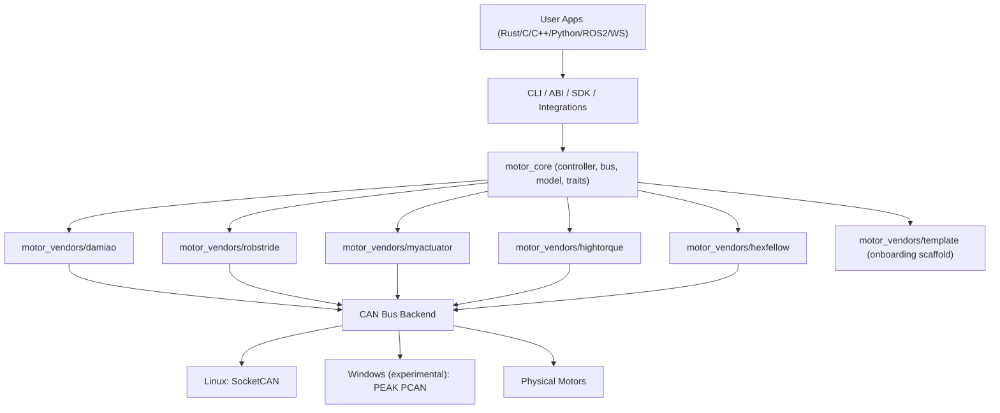
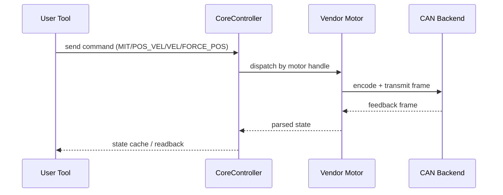

# Architecture

## Layered View



## Runtime Control Flow



## Design Goal

`motorbridge` separates generic control infrastructure from vendor-specific protocol logic.

- Core should be reusable across vendors.
- Vendor crates should contain protocol/register/model differences.
- ABI should expose stable cross-language entry points.

## Repository Layout

```text
motorbridge/
├── motor_core/                  # Vendor-agnostic runtime
├── motor_vendors/
│   ├── damiao/                  # Production implementation
│   ├── robstride/               # Production implementation (extended CAN ID / params)
│   ├── myactuator/              # Production implementation (RMD protocol)
│   ├── hightorque/              # Production implementation (ht_can protocol)
│   ├── hexfellow/               # Production implementation (CANopen over CAN-FD)
│   └── template/                # Scaffold for new vendors
├── motor_cli/                   # Rust CLI
├── motor_abi/                   # C ABI (cdylib + staticlib)
├── integrations/
│   ├── ros2_bridge/             # ROS2 bridge
│   └── ws_gateway/              # Rust WebSocket gateway
├── bindings/
│   ├── python/                 # Python SDK package + CLI
│   └── cpp/                    # C++ RAII wrapper + CMake package
├── examples/                    # C/C++/Python demo programs
└── docs/
    ├── en/
    └── zh/

Separate repo:
- `motorbridge-studio/`          # Web control UI extracted from `tools/factory_calib_ui_ws`
```

## Core Layers

### 1) `motor_core`

- `bus.rs`: CAN bus abstraction
- `device.rs`: unified `MotorDevice` trait
- `controller.rs`: scheduling/routing/polling
- `model.rs`: model catalog abstraction
- `socketcan.rs`: Linux classic SocketCAN backend
- `socketcanfd.rs`: Linux dedicated SocketCAN-FD backend
- `pcan.rs`: Windows PEAK PCAN backend (experimental)

### 2) `motor_vendors/*`

Each vendor crate implements:

- frame encode/decode
- register semantics
- motor model limits
- controller facade wrapping `CoreController`

### 3) `motor_abi`

- exports C-compatible handles and functions
- wraps Rust errors into integer return code + `motor_last_error_message()`
- enables C/C++/Python/etc integration
- serializes calls that use the same `MotorController` or `MotorHandle`
  internally; different handles may still be used from different threads
- `motor_controller_free` / `motor_handle_free` are exclusive ownership
  operations: do not call them concurrently with other operations on the same
  pointer, and do not use a pointer after free

### 4) SDK/Examples

- `motor_cli`: operational/debugging command-line tool
- `bindings/python`: reusable Python package for deployment/integration
- `bindings/cpp`: reusable C++ RAII wrapper for deployment/integration
- `examples/*`: minimal cross-language ABI usage references

## Lifecycle Policy

Controller lifecycle is explicit:

- Use `motor_controller_shutdown` when you want an explicit stop/disable flow.
- Use `motor_controller_close_bus` when you only want to close local session/bus.
- `motor_controller_free` now only releases memory/objects.
