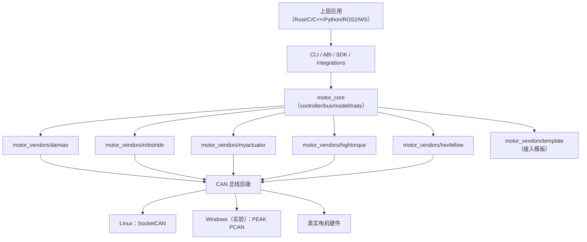
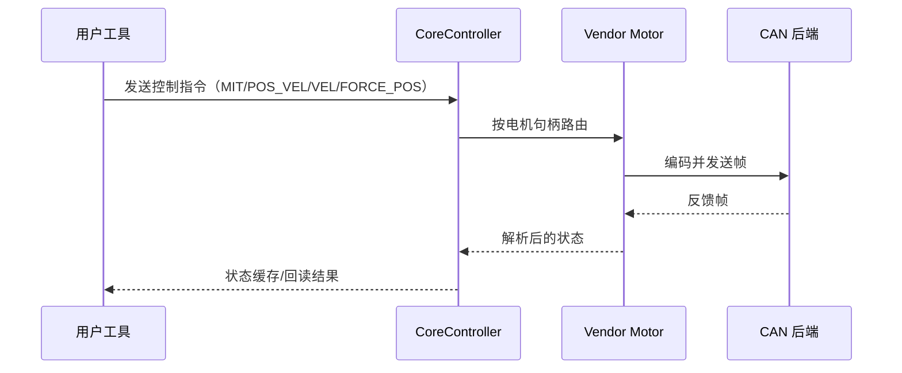

# 架构说明

## 分层视图



## 运行时控制流



## 设计目标

`motorbridge` 的核心目标是把通用控制能力与厂商协议细节解耦。

- 核心层可跨品牌复用
- 厂商差异下沉到 vendor crate
- 通过 ABI 暴露稳定跨语言接口

## 仓库结构

```text
motorbridge/
├── motor_core/                  # 与厂商无关的运行时
├── motor_vendors/
│   ├── damiao/                  # 生产可用实现
│   ├── robstride/               # 生产可用实现（扩展 ID / 参数协议）
│   ├── myactuator/              # 生产可用实现（RMD 协议）
│   ├── hightorque/              # 生产可用实现（ht_can 协议）
│   ├── hexfellow/               # 生产可用实现（CANopen over CAN-FD）
│   └── template/                # 新厂商模板
├── motor_cli/                   # Rust CLI
├── motor_abi/                   # C ABI (cdylib + staticlib)
├── integrations/
│   ├── ros2_bridge/             # ROS2 桥接
│   └── ws_gateway/              # Rust WebSocket 网关
├── bindings/
│   ├── python/                 # Python SDK 包 + CLI
│   └── cpp/                    # C++ RAII 封装 + CMake 包
├── examples/                    # C/C++/Python 示例
└── docs/
    ├── en/
    └── zh/

独立仓库：
- `motorbridge-studio/`          # 由 `tools/factory_calib_ui_ws` 拆出的 Web 控制台
```

## 分层说明

### 1) `motor_core`

- `bus.rs`：CAN 总线抽象
- `device.rs`：统一 `MotorDevice` 接口
- `controller.rs`：调度/路由/轮询
- `model.rs`：型号目录抽象
- `socketcan.rs`：Linux 经典 SocketCAN 后端
- `socketcanfd.rs`：Linux 独立 SocketCAN-FD 后端
- `pcan.rs`：Windows PEAK PCAN 后端（实验性）

### 2) `motor_vendors/*`

每个厂商 crate 负责：

- 帧编码/解码
- 寄存器语义
- 型号限制参数
- 基于 `CoreController` 的控制器封装

### 3) `motor_abi`

- 导出 C 兼容句柄与函数
- Rust 错误转换为返回码 + `motor_last_error_message()`
- 供 C/C++/Python 等语言集成
- 同一个 `MotorController` 或 `MotorHandle` 上的调用会在 ABI 内部串行化；
  不同 handle 仍可在不同线程使用
- `motor_controller_free` / `motor_handle_free` 是独占所有权操作：
  不要与同一指针上的其它操作并发调用，释放后也不能继续使用该指针

### 4) SDK 与示例

- `motor_cli`：运维/调试命令行
- `bindings/python`：可直接集成的 Python 包
- `bindings/cpp`：可直接集成的 C++ RAII 封装
- `examples/*`：最小化跨语言 ABI 调用示例

## 生命周期策略

控制器生命周期显式管理：

- 需要明确停止/失能流程时：调用 `motor_controller_shutdown`
- 只想关闭本地会话/总线时：调用 `motor_controller_close_bus`
- `motor_controller_free` 仅负责释放对象
