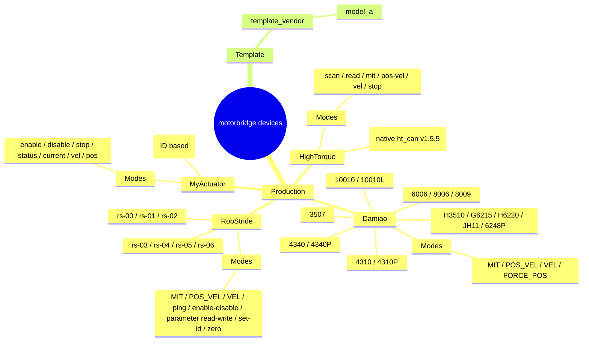

# 支持设备

<!-- channel-compat-note -->
## 通道兼容说明（PCAN + slcan + Damiao 串口桥）

- Linux SocketCAN 直接使用网卡名：`can0`、`can1`、`slcan0`。
- 串口类 USB-CAN 需先创建并拉起 `slcan0`：`sudo slcand -o -c -s8 /dev/ttyUSB0 slcan0 && sudo ip link set slcan0 up`。
- 仅 Damiao 提供串口桥链路（CLI）：`--transport dm-serial --serial-port /dev/ttyACM0 --serial-baud 921600`。
- Linux SocketCAN 下 `--channel` 不要带 `@bitrate`（例如 `can0@1000000` 无效）。
- Windows（PCAN 后端）中，`can0/can1` 映射到 `PCAN_USBBUS1/2`，可选 `@bitrate` 后缀。

## 支持全景图

## 生产可用支持

| 品牌 | 型号 | 控制模式 | 寄存器读写 | ABI 覆盖 | 说明 |
|---|---|---|---|---|---|
| Damiao | 3507, 4310, 4310P, 4340, 4340P, 6006, 8006, 8009, 10010L, 10010, H3510, G6215, H6220, JH11, 6248P | scan, enable, disable, MIT, POS_VEL, VEL, FORCE_POS, set-id, set-zero | 支持（f32/u32） | 支持 | 生产基线；修改 ID 建议使用 `--store 1 --verify-id 1` |
| RobStride | rs-00, rs-01, rs-02, rs-03, rs-04, rs-05, rs-06 | scan, ping, enable, disable, MIT, POS_VEL, VEL, parameter read/write, set-id, zero | 支持（i8/u8/u16/u32/f32） | 支持 | 使用 29-bit 扩展 CAN ID；默认 host/feedback ID 为 `0xFD`；set-id 对齐上位工具帧布局 |
| MyActuator | X-series（运行时 model 字符串，默认 `X8`） | enable, disable, stop, status, current, vel, pos, version, mode-query | 暂不支持（CLI 命令级支持） | 支持 | 使用标准 11-bit ID：`0x140+id` / `0x240+id`；常用 ID 范围 1..32 |
| HighTorque | hightorque（运行时 model 字符串；原生 `ht_can v1.5.5`） | scan, read, MIT, POS_VEL, VEL, stop, brake, rezero | 暂不支持（vendor 命令级支持） | 支持 | 对外统一 `rad/rad/s/Nm` 接口；原生 payload 缩放由实现层处理 |

## 模板（非生产）

| 品牌 | 型号 | 控制模式 | 寄存器读写 | ABI 覆盖 | 说明 |
|---|---|---|---|---|---|
| template_vendor | model_a（占位） | 占位实现 | 占位实现 | 不支持 | 新厂商接入模板 |

## 模式说明

- MIT：位置 + 速度 + 刚度 + 阻尼 + 力矩前馈
- POS_VEL：位置 + 速度限制
- VEL：速度控制
- FORCE_POS：位置 + 速度限制 + 力矩比例

